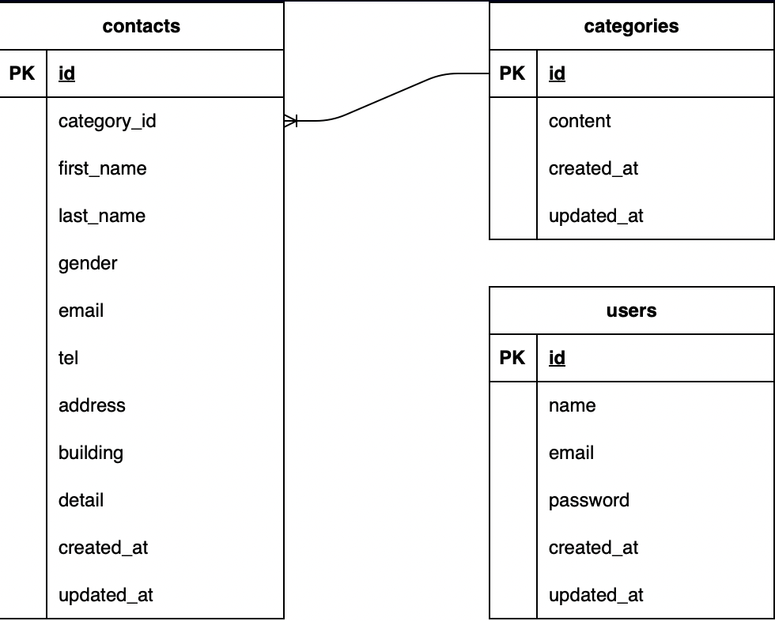

# アプリケーション名

お問い合わせフォーム

## 環境構築

### Dockerビルドと起動

1. リポジトリをクローンします。

   ```bash
   git clone git@github.com:hgleam/coachtech-checktest.git
   cd coachtech-checktest
   ```
2. Dockerコンテナをビルドしてバックグラウンドで起動します。

   ```bash
   docker-compose up -d --build
   ```

   \* MySQLは、OSによって起動しない場合があるのでそれぞれのPCに合わせて `docker-compose.yml` ファイルを編集してください。

### Laravel環境構築

1. 実行中のPHPコンテナに入ります。
   ```bash
   docker-compose exec php bash
   ```
2. コンテナ内で以下のコマンドを実行し、Laravelの依存関係をインストールします。
   ```bash
   composer install
   ```
3. `.env.example` ファイルをコピーして `.env` ファイルを作成し、環境変数（特にデータベース接続情報など）を適切に設定します。
   ```bash
   cp .env.example .env
   # .env ファイルを編集して、docker-compose.ymlのmysqlコンテナ設定(DB_HOST, DB_DATABASE, DB_USERNAME, DB_PASSWORD)を確認・設定
   # mysqlのサービス名 → .envのDB_HOST
   # MYSQL_DATABASE → .envのDB_DATABASE
   # MYSQL_USER → .envのDB_USERNAME
   # MYSQL_PASSWORD → .envのDB_PASSWORD
   ```
4. アプリケーションキーを生成します。
   ```bash
   php artisan key:generate
   ```
5. データベースマイグレーションを実行します。
   ```bash
   php artisan migrate
   ```
6. シーディングを実行して初期データを投入します。（もし `DatabaseSeeder` に初期データ投入処理が記述されていれば）
   ```bash
   php artisan db:seed
   ```

## 使用技術(実行環境)

- PHP 7.4.9
- Laravel 8.83.29
- MySQL 8.0.26
- Docker / Docker Compose

## ER図

実際のER図はプロジェクトルートにある `er_diagram.drawio` を参照してください。
下記の画像はPNG形式にエクスポートしたものです。


## URL

※docker-compose.ymlで80番ポートが私の環境では利用していたので81番ポートで構築している点はご注意ください。

- 開発環境 (お問い合わせフォーム): [http://localhost:81/](http://localhost:81/)
- phpMyAdmin: [http://localhost:8080/](http://localhost:8080/)
- 管理画面: [http://localhost:81/admin](http://localhost:81/admin) (ログイン後アクセス可能)

## 主な機能

- お問い合わせフォーム（入力、確認、完了）
- 管理画面
  - お問い合わせ一覧表示・検索
  - お問い合わせ詳細表示（モーダル）
  - お問い合わせ削除
  - お問い合わせ情報CSVエクスポート
